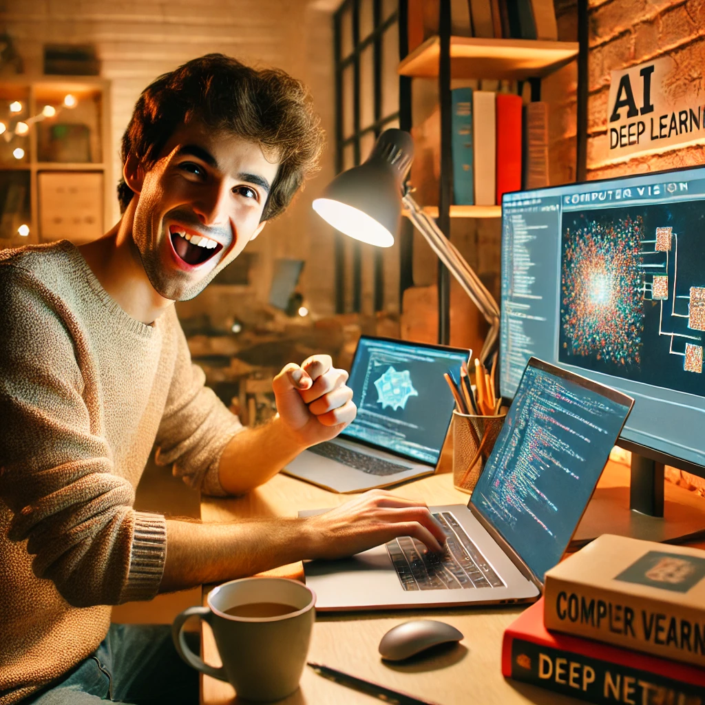

<p align="center">
    
</p>

## Restoration OCR - finetuning DiffBIR


### Code preparation

```shell
# clone repo
git clone https://github.com/jinlovespho/diffbir_finetuning.git
cd diffbir_finetuning 

# create environment
conda create -n pho_ocr python=3.10 -y
conda activate pho_ocr

# install libraries
# install torch first
pip install torch==2.2.2 torchvision==0.17.2 torchaudio==2.2.2 --index-url https://download.pytorch.org/whl/cu121
# then install other libraries
pip install -r requirements.txt
```


### Run training script 
```shell
cd diffbir_finetuning
bash run_script/train/run_train_diffbir_rgb_ocrRecLoss.sh
```
